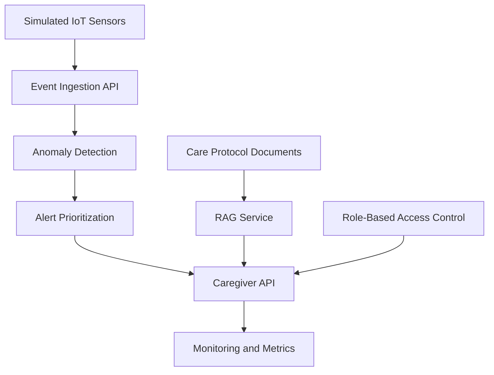

# Assisted Care AI DevOps Lab

A portfolio MVP demonstrating how **AI DevOps practices** can support **responsible, privacy-aware assisted-care workflows**.

This project explores how simulated **IoT sensor events**, **anomaly detection**, **caregiver alert prioritization**, (planned) **RAG-based care protocol assistance**, (planned) **RBAC**, **monitoring**, and **CI/CD** can be combined into a **production-oriented system prototype**.

**What this demonstrates (for AI DevOps / MLOps roles)**
- Event-driven service design (FastAPI) and clear API boundaries
- Deployment readiness: Docker / Docker Compose and CI with GitHub Actions
- Operational basics: health + metrics endpoints
- Responsible AI framing for sensitive domains (privacy awareness, explainability-oriented alerts)

## Current Status

Version: `0.1.0`

Implemented:
- FastAPI application skeleton
- `GET /health` and `GET /metrics`
- `GET /alerts` and `GET /residents/{resident_id}/alerts`
- basic test setup
- initial project structure + project-management doc placeholders

## Responsible AI Framing

This project is:
- **Not** a medical diagnosis system
- **Not** a surveillance system
- **Not** intended to replace caregivers
- Based on **simulated data only**
- Designed as a **portfolio + learning MVP**

Goal: demonstrate responsible AI DevOps thinking—**secure architecture**, **privacy awareness**, **explainability**, **basic observability**, and **reliable deployment patterns**.

## Example Use Case (Simulated)

Simulated assisted-care facility sensors:
- bed-mat
- motion
- door
- bathroom motion
- room climate
- emergency button

The system detects workflow risks such as:
- night-time bed exits
- no motion after bed exit
- frequent night activity
- abnormal room climate
- emergency button events

It then generates **explainable, prioritized alerts** for caregivers.

## Features

### Implemented (v0.1)
- FastAPI backend
- Health + metrics endpoints (`/health`, `/metrics`)
- Alert read endpoints (`/alerts`, `/residents/{resident_id}/alerts`)
- Basic test setup
- Docker + GitHub Actions CI

### Next (v0.2–v0.4)
- Simulated IoT sensor events + ingestion endpoints (`POST /events`, `POST /events/batch`)
- Bed-mat + motion anomaly detection
- Alert prioritization + acknowledgement (`POST /alerts/{alert_id}/acknowledge`)
- RAG assistant over care protocols (`POST /ask-care-protocol`)
- Role-based access control (mock → optional Keycloak integration)
- Security + privacy documentation
- Improved observability (structured logs, richer metrics, tracing)

## Architecture Overview



## API Endpoints

### Current

| Method | Endpoint | Description |
|---|---|---|
| GET | `/` | Service welcome message |
| GET | `/health` | Health check |
| GET | `/metrics` | Basic service metrics |
| GET | `/alerts` | Get prioritized alerts across all residents |
| GET | `/residents/{resident_id}/alerts` | Get prioritized alerts for a specific resident |

### Planned

| Method | Endpoint | Description |
|---|---|---|
| POST | `/events` | Submit sensor event |
| POST | `/events/batch` | Submit multiple sensor events |
| POST | `/alerts/{alert_id}/acknowledge` | Acknowledge alert |
| POST | `/ask-care-protocol` | Ask RAG assistant |
| GET | `/residents/{resident_id}/status` | Resident status summary |

## Run Locally

Create and activate a virtual environment:

```bash
python3 -m venv .venv
source .venv/bin/activate
pip install -e ".[dev]"
uvicorn app.main:app --reload
```

Open:

```text
http://127.0.0.1:8000/docs
```

## Tests

```bash
pytest
```

## Roadmap

### v0.1 Foundation (done)
- Service skeleton + repo structure
- Health/metrics + initial alert endpoints
- Docker + CI pipeline
- Basic tests + documentation placeholders

### v0.2 Sensor + Alert MVP
- Event models + simulated event generator
- Event ingestion endpoints
- Detection + prioritization logic wired end-to-end
- Test coverage for core workflows

### v0.3 RAG + Responsible AI
- Care protocol document set + RAG service
- Guardrails: “not diagnosis”, transparency notes, prompt boundaries
- RBAC (mock roles) + security/privacy documentation
- RAG tests + basic evaluation notes

### v0.4 DevOps Readiness
- Docker Compose for local stack
- Improved observability (structured logs, Prometheus-style metrics, tracing)
- Architecture docs + “production hardening” notes (scaling, failure modes, data handling)


## Interview Relevance

This project is designed to support discussion around:

- AI DevOps
- MLOps and RAG systems
- IoT/event-driven architecture
- monitoring and observability
- secure and privacy-aware AI
- role-based access control
- project scoping and delivery
- responsible AI in sensitive environments
