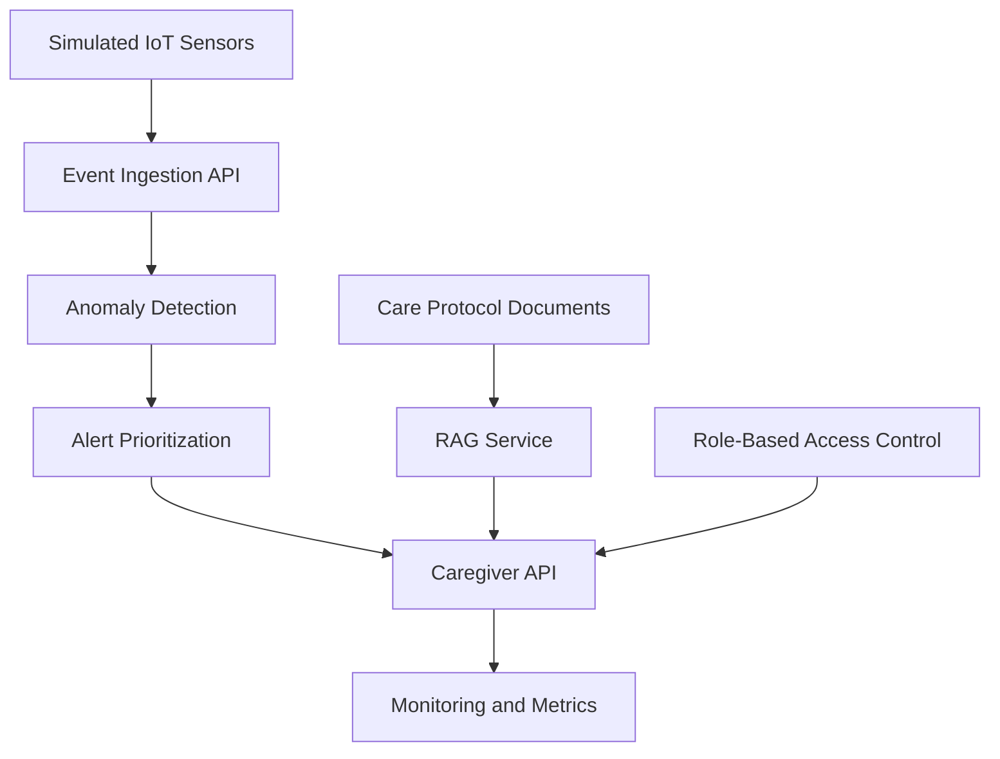

# Assisted Care AI DevOps Lab

A portfolio MVP demonstrating how **AI DevOps practices** can support **responsible, privacy-aware assisted-care workflows**.

This project explores how simulated **IoT sensor events**, **anomaly detection**, **caregiver alert prioritization**, (planned) **RAG-based care protocol assistance**, (planned) **RBAC**, **monitoring**, and **CI/CD** can be combined into a **production-oriented system prototype**.

**What this demonstrates (for AI DevOps / MLOps roles)**
- Event-driven service design (FastAPI) and clear API boundaries
- Deployment readiness: Docker / Docker Compose and CI with GitHub Actions
- Operational basics: health + metrics endpoints
- Responsible AI framing for sensitive domains (privacy awareness, explainability-oriented alerts)

## Current Status

Version: `0.1.0`

Implemented:
- FastAPI application skeleton
- `GET /health` and `GET /metrics`
- `GET /alerts` and `GET /residents/{resident_id}/alerts`
- basic test setup
- initial project structure + project-management doc placeholders

## Responsible AI Framing

This project is:
- **Not** a medical diagnosis system
- **Not** a surveillance system
- **Not** intended to replace caregivers
- Based on **simulated data only**
- Designed as a **portfolio + learning MVP**

Goal: demonstrate responsible AI DevOps thinking—**secure architecture**, **privacy awareness**, **explainability**, **basic observability**, and **reliable deployment patterns**.

## Planned Features

- FastAPI backend
- Simulated IoT sensor events
- Bed-mat and motion-sensor anomaly detection
- Caregiver alert prioritization
- RAG assistant over care protocols
- Role-based access control mock
- Monitoring endpoint
- Dockerized deployment
- GitHub Actions CI
- Project management documentation
- Security and privacy documentation

## Current Status

Version: `0.1.0`

Implemented:

- Initial FastAPI application
- `/health` endpoint
- `/metrics` endpoint
- `/alerts` endpoint
- `/residents/{id}/alerts` endpoint
- Basic test setup
- Project structure
- Initial project-management documentation placeholders

## Architecture Overview



## API Endpoints

### Current

| Method | Endpoint | Description |
|---|---|---|
| GET | `/` | Service welcome message |
| GET | `/health` | Health check |
| GET | `/metrics` | Basic service metrics |
| GET | `/alerts` | Get prioritized alerts across all residents |
| GET | `/residents/{resident_id}/alerts` | Get prioritized alerts for a specific resident |

### Planned

| Method | Endpoint | Description |
|---|---|---|
| POST | `/events` | Submit sensor event |
| POST | `/events/batch` | Submit multiple sensor events |
| POST | `/alerts/{alert_id}/acknowledge` | Acknowledge alert |
| POST | `/ask-care-protocol` | Ask RAG assistant |
| GET | `/residents/{resident_id}/status` | Resident status summary |

## Run Locally

Create and activate a virtual environment:

```bash
python3 -m venv .venv
source .venv/bin/activate
```

Install dependencies:

```bash
pip install -e ".[dev]"
```

Run the API:

```bash
uvicorn app.main:app --reload
```

Open:

```text
http://127.0.0.1:8000/docs
```

## Run Tests

```bash
pytest
```

## Roadmap

### v0.1 Foundation

- [x] Create repository structure
- [x] Add FastAPI app
- [x] Add health endpoint
- [x] Add metrics endpoint
- [x] Add first test
- [x] Add Dockerfile content
- [x] Add GitHub Actions CI
- [x] Fill project-management docs

### v0.2 Sensor and Alert MVP

- [x] Add Pydantic models
- [x] Add simulated sensor event generator
- [x] Add anomaly detection
- [x] Add alert prioritization
- [x] Add event and alert API endpoints
- [ ] Add tests

### v0.3 RAG and Responsible AI

- [ ] Add care protocol documents
- [ ] Add RAG service
- [ ] Add role-based access control
- [ ] Add security and privacy documentation
- [ ] Add RAG tests

### v0.4 DevOps Readiness

- [x] Add Docker Compose
- [ ] Add improved monitoring
- [x] Add CI pipeline with Docker build
- [ ] Add architecture documentation
- [ ] Add future production roadmap

## Interview Relevance

This project is designed to support discussion around:

- AI DevOps
- MLOps and RAG systems
- IoT/event-driven architecture
- monitoring and observability
- secure and privacy-aware AI
- role-based access control
- project scoping and delivery
- responsible AI in sensitive environments
