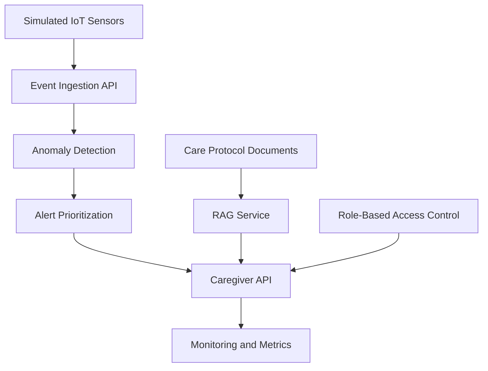

# Assisted Care AI DevOps Lab

A portfolio MVP demonstrating how AI DevOps practices can support responsible, privacy-aware assisted-care workflows.

The project explores how simulated IoT sensor events, anomaly detection, caregiver alert prioritization, RAG-based care protocol assistance, role-based access control, monitoring and CI/CD can be combined into a production-oriented AI system prototype.

## Responsible AI Framing

This project is:

- not a medical diagnosis system
- not a surveillance system
- not intended to replace caregivers
- based on simulated data only
- designed as a portfolio and learning MVP

The goal is to demonstrate responsible AI DevOps thinking:
secure architecture, privacy awareness, explainability, observability and reliable deployment patterns.

## Example Use Case

An assisted-care facility uses simulated sensors such as:

- bed-mat sensors
- motion sensors
- door sensors
- bathroom motion sensors
- room climate sensors
- emergency buttons

The system identifies care-workflow risks such as:

- night-time bed exits
- no motion after bed exit
- frequent night activity
- abnormal room climate
- emergency button events

The system then generates explainable alerts and prioritizes them for caregivers.

## Planned Features

- FastAPI backend
- Simulated IoT sensor events
- Bed-mat and motion-sensor anomaly detection
- Caregiver alert prioritization
- RAG assistant over care protocols
- Role-based access control mock
- Monitoring endpoint
- Dockerized deployment
- GitHub Actions CI
- Project management documentation
- Security and privacy documentation

## Current Status

Version: `0.1.0`

Implemented:

- Initial FastAPI application
- `/health` endpoint
- `/metrics` endpoint
- Basic test setup
- Project structure
- Initial project-management documentation placeholders

## Architecture Overview



## API Endpoints

Current:

| Method | Endpoint | Description |
|---|---|---|
| GET | `/` | Service welcome message |
| GET | `/health` | Health check |
| GET | `/metrics` | Basic service metrics |

Planned:

| Method | Endpoint | Description |
|---|---|---|
| POST | `/events` | Submit sensor event |
| POST | `/events/batch` | Submit multiple sensor events |
| GET | `/alerts` | Get prioritized alerts |
| POST | `/alerts/{alert_id}/acknowledge` | Acknowledge alert |
| POST | `/ask-care-protocol` | Ask RAG assistant |
| GET | `/residents/{resident_id}/status` | Resident status summary |

## Run Locally

Create and activate a virtual environment:

```bash
python3 -m venv .venv
source .venv/bin/activate
```

Install dependencies:

```bash
pip install -e ".[dev]"
```

Run the API:

```bash
uvicorn [app.main](https://app.main):app --reload
```

Open:

```text
http://127.0.0.1:8000/docs
```

## Run Tests

```bash
pytest
```

## Roadmap

### v0.1 Foundation

- [x] Create repository structure
- [x] Add FastAPI app
- [x] Add health endpoint
- [x] Add metrics endpoint
- [x] Add first test
- [x] Add Dockerfile content
- [x] Add GitHub Actions CI
- [ ] Fill project-management docs

### v0.2 Sensor and Alert MVP

- [ ] Add Pydantic models
- [ ] Add simulated sensor event generator
- [ ] Add anomaly detection
- [x] Add alert prioritization
- [ ] Add event and alert API endpoints
- [ ] Add tests

### v0.3 RAG and Responsible AI

- [ ] Add care protocol documents
- [ ] Add RAG service
- [ ] Add role-based access control
- [ ] Add security and privacy documentation
- [ ] Add RAG tests

### v0.4 DevOps Readiness

- [ ] Add Docker Compose
- [ ] Add improved monitoring
- [ ] Add CI pipeline with Docker build
- [ ] Add architecture documentation
- [ ] Add future production roadmap

## Interview Relevance

This project is designed to support discussion around:

- AI DevOps
- MLOps and RAG systems
- IoT/event-driven architecture
- monitoring and observability
- secure and privacy-aware AI
- role-based access control
- project scoping and delivery
- responsible AI in sensitive environments